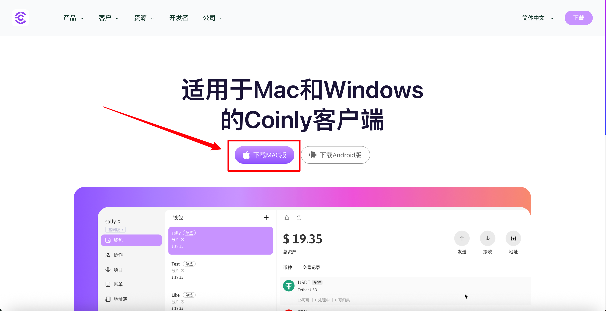
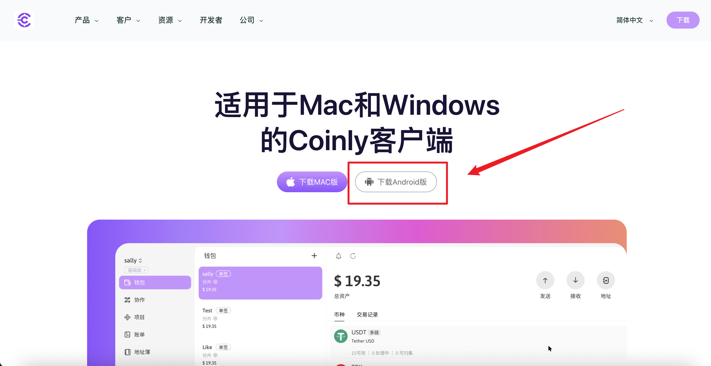

# 下载及安装

## PC版

下载并安装Coinly电脑客户端[访问下载链接](https://www.hhnumilala.top/zh-CN/download)往下翻，选择您的操作系统以下载对应的Coinly安装包

<figure>
    
</figure>

## Android版

<figure>
    
</figure>

下载完成后，双击安装包，按照指示将Coinly客户端安装到电脑上。

